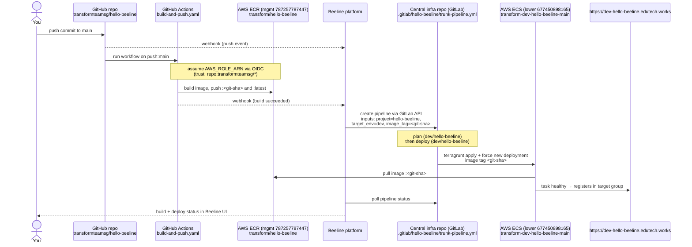
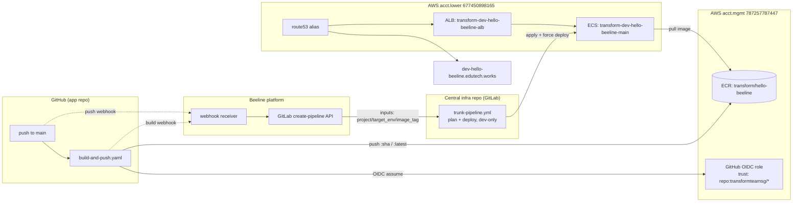

# CI/CD flow: GitHub + GitLab + Beeline

How a push to `main` reaches the live app. Based on the Beeline platform
architecture (platform `README.md`, §2). Key point: **GitHub CI does not
trigger the GitLab deploy pipeline directly — Beeline does**, after it receives
the build-success webhook.

## Sequence

## Component map (who owns what)

## Notes

- **Deployed image tag is the git SHA** (`github.sha` from the workflow), not a
  placeholder. A manual `terragrunt apply` with a non-existent tag (e.g.
  `abcde`) causes `CannotPullContainerError`; the real flow feeds a valid SHA
  that exists in ECR.
- **Beeline is the trigger, not GitHub.** For the automated path, Beeline must
  receive the build-success webhook and be configured to call the GitLab
  pipeline with `project=hello-beeline, target_env=dev`. The same pipeline can
  be triggered manually (GitLab Run pipeline with those inputs); the infra side
  is identical.
- **Two AWS accounts**: the image lives in **mgmt**; the running service, ALB,
  and DNS live in **lower**. ECS in lower pulls cross-account from the mgmt ECR.
